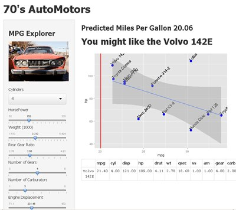

MPG Explorer
========================================================
transition: rotate  
transition-speed: slow  
css:css.css  
width: 1440
height: 900 

author: R. Scott Robinett  
date: December 20, 2014   


***

At 70s AutoMotors we are continuely searching for better ways to serve our valuable customers.  The MPG Explorer &copy; implements a simple randomForest model that allows users to find a vehicle that best matches their MPG requirements.  

randomForest -  a learning algorithm that operate by constructing a multitude of decision trees   

<span style="font-size:22px;font-style: italic;">MPG Explorer &copy; 2014</span>

Introduction
========================================================
type: intro



### Model  
First, select the model you would like to use, either Linear or randomForest.  

### Cylinders  
When the application loads, it uses the averages for each slider, calculated from the number of Cylinders (4 cylinders is loaded initially)


***
### Dynamic values  
Select the number of cylinders from the dropdown.  Note that changing the number of cylinders will reload the averages in the sliders.  This gives the user a starting point.  


### Sliders  
Then, use the sliders to get a prediction of MPG that will fit the users needs. As each slider is moved, the user will see the predicted mpg and a recommendation from our stock of automobiles. The plot will show the user the relationship to other automobiles.

## It's just that easy!!


How it works
========================================================
type:analysis

_The model (either linear or randomForest) uses the vehicles in stock (__mtcars__) as the dataset.  *MPG* is the dependent variable; number of cylinders, horsepower, weight, rear drive gear, forward gears, number of carburators and engine displacement are used as the predictors._  
* lm1 <- _model_(mpg~as.numeric(cyl)+hp+wt+drat+gear+carbs+disp, data=dataset)  

_values are derived from the slider input_ (this is sample input)  
* pred <- data.frame(cyl=4,hp=100,wt=2.8,drat=3.4,disp=200,gear=3.4,carb=2)    

_prediction is created with the predict function, taking the model(lm1) and the input(pred) as parameters_ 
* prd <- predict(lm1, pred)

Since this is a prototype, we have intentionally keep this simple, and have not fully thought through the details of the applicaiton or feel completely assured of the model efficiency. Note the wide variance of the predictions from each model.  


<table>
<tr>
<th>Model</th><th>Predicted MPG (from sample)</th>
</tr>
<tr>
<td>randomForest</td><td>``21.36``</td>
</tr>
<tr>
<td>linear</td><td>``23.66``</td>
</tr>

</table>
<small>Service Department is counting the cupholders and we will include those in the next model, but I'm not sure what that has to do with mpg.</small>   


Evaluation of the model
========================================================
type:illustration

Random Forest Model
 

Linear Model

 


***
### Variable importance in the randomForest Model    


```
     IncNodePurity
cyl         188.51
hp          216.76
wt          253.30
drat         77.28
disp        232.68
gear         21.44
carb         43.74
```

<br>
<br>


### Coefficients of Linear Model

<table>
<tr>
<th>(Intercept)</th><th>cyl</th><th>hp</th><th>wt</th><th>drat</th><th>disp</th><th>gear</th><th>carb</th>
</tr>
<tr>
<td>``30.0154``</td><td>``-0.7511``</td><td>``-0.021``</td><td>``-2.962``</td><td>``0.9689``</td><td>``0.0072``</td>
<td>``0.9683``</td><td>``-0.4937``</td>
</tr>
</table>

Conclusion
========================================================
type:conclude


<small>70s AutoMotors is a progressive company that is looking to utilize advance techniques to serve our customers.  If you would like more information about this application, please see Scott in the Parts Department.</small>    

Please take a look, and be prepared to offer your input at the staff meeting on Friday at 9:30am in the conference room (coffee and bagels will be served).  

[Go to the Application](http://rsrobinett.shinyapps.io/devDataProducts)
***

