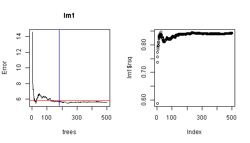

MPG Explorer
========================================================
transition: rotate  
transition-speed: slow  
css:css.css  
width: 1440
height: 900 

author: R. Scott Robinett  
date: December 12, 2014   


***
At 70s AutoMotors we are continuely searching for better ways to serve our valuable customers.  The MPG Explorer &copy; implements a simple linear regression model that allows users to find a vehicle that best matches their MPG requirements.  


<span style="font-size:22px;font-style: italic;">MPG Explorer &copy; 2014</span>

Introduction
========================================================
type: intro


***
[Click here to Go to the Application](http://rsrobinett.shinyapps.io/devDataProducts)  

Using the sliders in the left panel. 

* Select number of cylinders
* Select horsepower
* Select weight
* Select rear gear ratio  

See the predicted mpg and a recommendation.  

See the predicted value in the plot in relation to the other vehicles.  
* It's just that easy!!


How it works
========================================================
type:analysis

_The linear regression model uses the vehicles in stock (__mtcars__) as the dataset.  *mpg* is the dependent variable; number of cylinders, horsepower, weight and rear drive gear are used as the predictors._  
* lm1 <- lm(mpg~as.numeric(cyl)+hp+wt+drat, data=dataset)  

_values are derived from the slider input_
* pred <- data.frame(cyl=input$cyl,hp=input$hp,wt=input$wt,drat=input$drat)  

_prediction is created with the predict function_ 
* prd <- predict(lm1, pred, interval="confidence")

Since this is a prototype, we have intentionally keep this simple and have already found confidence levels to be less than optimal.  


```
    fit   lwr   upr
1 23.81 21.33 26.29
```
<small>Future implementations will include transmission type, elapsed time through the quarter mile, and staff are collecting additional data for number of cup holders,</small>   


Evaluation of the model
========================================================
type:illustration

### Residuals
 
***

### Standard Errors
7.441, 0.635, 0.013, 0.8182, 1.3868  

### Coefficients: 
<table>
<tr>
<th>(Intercept)</th><th>cyl</th><th>hp</th><th>wt</th><th>drat</th>
</tr>
<tr>
<td>34.4959</td><td>-0.7623</td>
<td>-0.0209</td><td>-2.9733</td><td>0.8177</td>
</tr>
</table>  
<small>Joe in the Service Department says that horsepower is the biggest predictor for mpg, but Scott insist that weight is the most influential predictor and the coefficiences seem to prove that.  

Residuals appear to be biased and heteroscedastic.  Not exactly what we want, but close enough for our application.
</small>

Conclusion
========================================================
type:conclude


<small>70s AutoMotors is a progressive company that is looking to utilize advance techniques to serve our customers.  If you would like more information about this application, please see Scott in the Parts Department.</small>    

Please take a look, and be prepared to offer your input at the staff meeting on Friday, December 12 at 9:30am in the conference room (coffee and bagels will be served).  

[Go to the Application](http://rsrobinett.shinyapps.io/devDataProducts)
***

